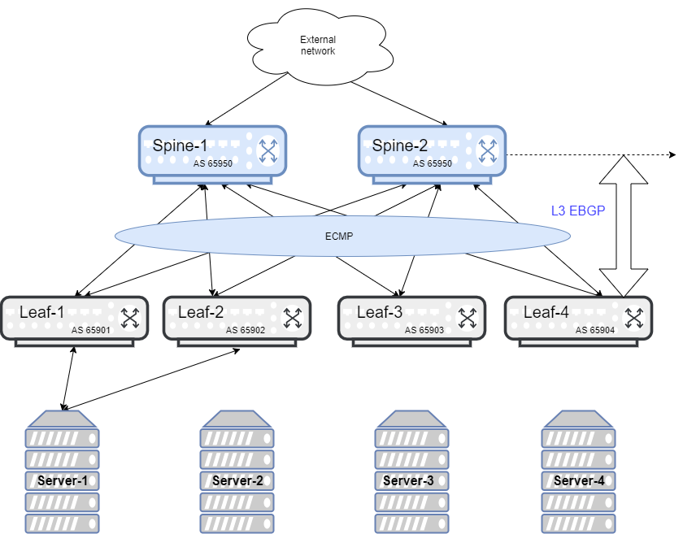

#########################################################################
Provision CLOS fabric using Dell EMC Networking Saltstack modules example
#########################################################################

This example describes how to use SaltStack to build a CLOS fabric with Dell EMC Networking OS10 switches. The sample topology is a two-tier CLOS fabric with two spines and four leafs connected as mesh. EBGP is running between the two tiers.

All switches in spine have the same AS number, and each leaf switch has a unique AS number. All AS number used are private. For application load-balancing purposes, the same prefix is advertised from multiple leaf switches and uses *BGP multipath relax* feature.

Step 1
******

Create a salt-proxy for the OS10 switches (see :ref:`Configure the connection with a device <configure_connection_to_device>`). Switches used in the topology are named as ``spine1``, ``spine2``, ``leaf1``, ``leaf2``, ``leaf3``, ``leaf4``. 

In a new terminal session, test your switch to confirm it is configured correctly:

::

  sudo salt '*' test.ping

Step 2
******

Edit the salt-master configuration and append the ``file_roots`` value. The default salt-master configuration location is ``/etc/salt/master``:

::

    file_roots:
      base:
         - /srv/salt/states
         - /srv/salt/pillar
         - /srv/salt/states/configuration

Step 3
******

Download the CLOS fabric configuration.

:download:`spine1 <config/spine1.cfg>` :download:`spine2 <config/spine2.cfg>` :download:`leaf1 <config/leaf1.cfg>` :download:`leaf2 <config/leaf2.cfg>` :download:`leaf3 <config/leaf3.cfg>` :download:`leaf4 <config/leaf4.cfg>`

Copy all the downloaded configuration files in the salt-server directory ``/srv/salt/states/configuration``.

Step 4
******

Edit the pillar configuration and append for each switch:

::

    proxy:
      proxytype: napalm
      driver: dellos10
      host: 192.168.128.128
      username: my_username
      passwd: my_password
      optional_args:
        global_delay_factor: 3 # This is optional value, increase value in case device response is slow
    config_file: leaf1.cfg

Repeat for all switches in the pillar data.

Step 5
******

Create a states file in ``/srv/salt/states`` named ``clos_load_config.sls``:

::

    clos_config:
      netconfig.managed:
        - template_name: salt://{{ pillar.get('config_file') }}

Step 6
******

Push the CLOS configuration into all switches:

::

    salt "*" state.sls clos_load_config
